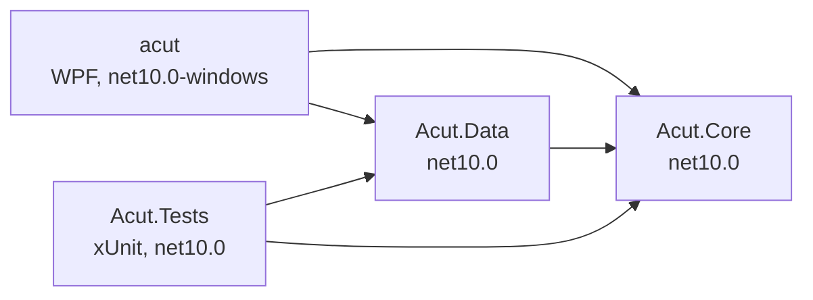
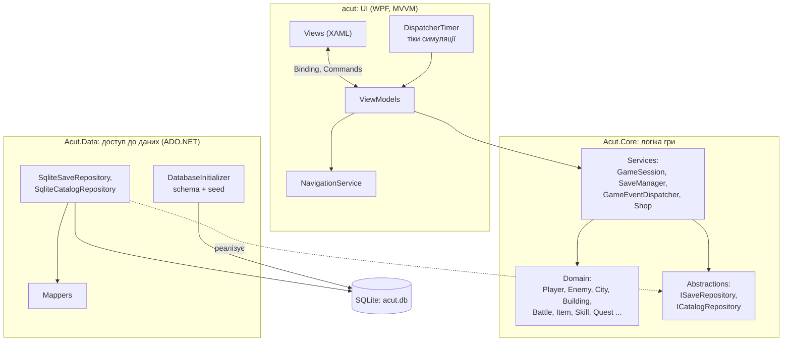
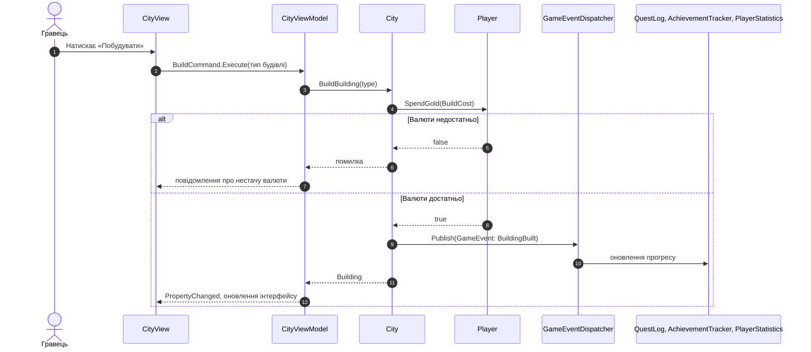
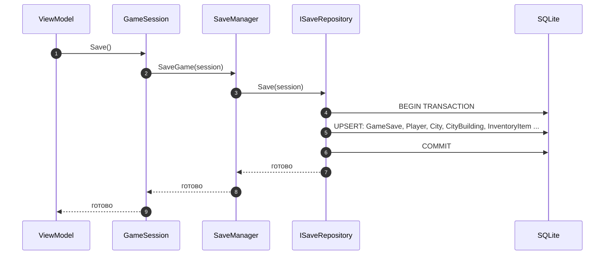

# Документ архітектури проєкту AcutStudio

Етап 4: проєктування архітектури та даних. Діаграми написані в **Mermaid** і автоматично відображаються на GitHub. Назви класів відповідають діаграмі класів з `UML_Class_State_DIagrams.md`.

Зміст:

1. [Вихідні дані та обмеження](#1-вихідні-дані-та-обмеження)
2. [Архітектурний підхід](#2-архітектурний-підхід)
3. [Структура рішення](#3-структура-рішення)
4. [Компоненти та їхня відповідальність](#4-компоненти-та-їхня-відповідальність)
5. [Схема взаємодії компонентів](#5-схема-взаємодії-компонентів)
6. [Модель даних](#6-модель-даних)
7. [Збереження та завантаження гри](#7-збереження-та-завантаження-гри)
8. [Обґрунтування ключових рішень](#8-обґрунтування-ключових-рішень)
9. [Відповідність нефункціональним вимогам](#9-відповідність-нефункціональним-вимогам)
10. [Що виходить за межі цього етапу](#10-що-виходить-за-межі-цього-етапу)

---

## 1. Вихідні дані та обмеження

**Продукт:** настільна гра для Windows, що поєднує симулятор розвитку міста (будівлі, валюта, дерево навичок, завдання, крафтинг, біржа) і покрокову бойову систему.

**Обмеження курсу:** C#, .NET, настільний застосунок, WPF (XAML), ADO.NET для роботи з даними, реляційна БД за потреби, автоматизовані тести, GitHub Actions.

**Поточний стан репозиторію:** є лише каркас WPF-проєкту `acut` (`net10.0-windows`). Вся структура нижче проєктується з нуля й узгоджена з документами етапів 1–3.

**Вимоги, що найбільше впливають на архітектуру** (з `Requirements_Document.md`):

| Вимога | Наслідок для архітектури |
| :--- | :--- |
| Масштабованість: легко додавати нові будівлі, навички, ворогів, предмети, завдання | Ігровий контент задається **даними (каталогом у БД)**, а не жорстко в коді. Нові типи додаються через наслідування та Strategy |
| Надійне збереження прогресу (місто, інвентар, характеристики, позиція в бою) | Збереження в реляційну БД **однією транзакцією**; бій, що триває, теж зберігається |
| Продуктивність без затримок під час симуляції та ходів | Логіка гри окремо від UI, без блокування потоку інтерфейсу; збереження швидке (локальний SQLite) |
| Зручність UI | UI відділений від логіки (MVVM), екрани відповідають макетам з `UIMakets.md` |
| Автоматизовані тести критичної логіки | Ядро гри не залежить від WPF і БД, тому тестується без запуску інтерфейсу |

---

## 2. Архітектурний підхід

Обрано **шарову архітектуру з інверсією залежностей** і шаблон **MVVM** на рівні інтерфейсу.

Три шари:

1. **UI (`acut`)**: WPF, XAML, MVVM. Показує стан і приймає дії гравця.
2. **Core (`Acut.Core`)**: ігрова логіка. Містить доменні класи (`Player`, `Battle`, `City`, `Building` та інші) і сервіси (`GameSession`, `SaveManager`, `GameEventDispatcher`, `Shop`). Не залежить ні від WPF, ні від БД.
3. **Data (`Acut.Data`)**: доступ до даних через ADO.NET і SQLite. Реалізує інтерфейси репозиторіїв, оголошені в Core.

**Правило залежностей:** залежності спрямовані до Core. Core не знає про UI та Data. Інтерфейси `ISaveRepository` та `ICatalogRepository` оголошені в Core, а реалізовані в Data (принцип інверсії залежностей). Це дає змогу підміняти БД в тестах і зберігає ядро чистим.

**Шаблони проєктування, закладені в рішення:**

| Шаблон | Де застосовано | Навіщо |
| :--- | :--- | :--- |
| MVVM | UI | Розділення XAML-розмітки та логіки екрана, прив'язка даних і команди |
| Repository | Core (інтерфейси) / Data (реалізація) | Ізоляція SQL від логіки гри |
| Strategy | `IEnemyStrategy` | Унікальна поведінка кожного ворога |
| Observer / подієва шина | `GameEvent`, `GameEventDispatcher` | Завдання, досягнення й статистика реагують на події без прямих залежностей |
| Dependency Injection | Composition root у `App.xaml.cs` | Збирання залежностей в одному місці, зручне тестування |
| Наслідування | `Character`, `Building`, `Item` | Додавання нових типів без зміни наявного коду |

---

## 3. Структура рішення

### 3.1 Проєкти та залежності



`acut` одночасно є **composition root**: саме там створюються репозиторії й сервіси та передаються у ViewModel.

### 3.2 Структура каталогів

```text
project/
├── acut.slnx
├── acut/                          # WPF-застосунок (UI)
│   ├── Views/                     # XAML-екрани
│   ├── ViewModels/                # ViewModel для кожного екрана
│   ├── Services/                  # NavigationService, DialogService
│   ├── Converters/                # XAML-конвертери
│   ├── App.xaml
│   └── App.xaml.cs                # composition root (DI)
├── Acut.Core/                     # ігрова логіка
│   ├── Domain/
│   │   ├── Characters/            # Character, Player, Enemy, AppearanceSettings
│   │   ├── Combat/                # Battle, BattleAction, ActionResult, IEnemyStrategy та стратегії
│   │   ├── Economy/               # City, Building та типи, StockMarket, Stock
│   │   ├── Items/                 # Item, Potion, Weapon, Armor, Recipe, Inventory, ItemStack
│   │   └── Progress/              # SkillTree, Skill, QuestLog, Quest, AchievementTracker, PlayerStatistics, GameEvent
│   ├── Services/                  # GameSession, SaveManager, Shop, GameEventDispatcher
│   └── Abstractions/              # ISaveRepository, ICatalogRepository
├── Acut.Data/                     # доступ до даних
│   ├── Sqlite/                    # SqliteConnectionFactory, SqliteSaveRepository, SqliteCatalogRepository
│   ├── Mapping/                   # перетворення рядків БД у доменні об'єкти й назад
│   ├── Sql/                       # schema.sql, seed.sql (вбудовані ресурси)
│   └── DatabaseInitializer.cs     # створення схеми та наповнення каталогу
├── Acut.Tests/                    # автоматизовані тести (етап 7)
└── Docs/                          # документація
```

### 3.3 Технології та пакети

| Призначення | Рішення |
| :--- | :--- |
| Мова, платформа | C#, .NET 10 |
| Інтерфейс | WPF, XAML, MVVM |
| База даних | SQLite (файл `acut.db`) |
| Доступ до даних | ADO.NET через провайдер `Microsoft.Data.Sqlite` (без ORM) |
| Впровадження залежностей | `Microsoft.Extensions.DependencyInjection` |
| Тести (етап 7) | xUnit |
| CI (етап 8) | GitHub Actions |

---

## 4. Компоненти та їхня відповідальність

### 4.1 Шар UI (`acut`)

| Компонент | Відповідальність |
| :--- | :--- |
| **Views (XAML)** | Відображення екранів: головне меню, завантаження, лобі (місто), інвентар, крафтинг, бій, перемога, налаштування. Без логіки в code-behind, окрім суто візуальної |
| **ViewModels** | Стан екрана та команди (`ICommand`). Викликають методи Core, повідомляють View про зміни через `INotifyPropertyChanged` |
| **NavigationService** | Перемикання екранів. Реагує на зміни `GameSession.CurrentState` (меню, місто, бій, пауза тощо) |
| **Таймер симуляції** | `DispatcherTimer`, який викликає `City.Tick()`. Зупиняється у стані «Пауза» (за діаграмою станів) |

### 4.2 Шар Core (`Acut.Core`)

| Компонент | Відповідальність |
| :--- | :--- |
| **GameSession** | Точка входу в логіку: поточний стан гри, `Player`, `City`, активний `Battle`. Нова гра, збереження, завантаження |
| **SaveManager** | Збереження та завантаження сесії через `ISaveRepository`, автозбереження |
| **GameEventDispatcher** | Розсилає `GameEvent` до `QuestLog`, `AchievementTracker`, `PlayerStatistics`. Єдине джерело тригерів |
| **Shop** | Купівля та покращення предметів, перевірка й списання валюти |
| **Domain-клас `Player`, `Enemy`, `Character`** | Характеристики, здоров'я, досвід, рівень, валюта. Інваріанти (наприклад, здоров'я не виходить за межі `0..MaxHealth`) |
| **Domain-клас `Battle`** | Покрокова логіка бою: хід гравця, хід ворога, перевірка результату |
| **Domain-клас `City`, `Building`** | Будівництво, покращення, дохід за тік. Типи будівель: `ResidentialBuilding`, `ProductionBuilding`, `WorkshopBuilding`, `MarketBuilding` |
| **Domain-клас `StockMarket`, `Stock`** | Спрощений симулятор біржі |
| **Domain-клас `Item`, `Inventory`, `Recipe`** | Предмети, інвентар, крафтинг зілля |
| **Domain-клас `SkillTree`, `QuestLog`, `AchievementTracker`, `PlayerStatistics`** | Прогрес гравця |
| **ISaveRepository, ICatalogRepository** | Контракти доступу до даних (тільки інтерфейси) |

### 4.3 Шар Data (`Acut.Data`)

| Компонент | Відповідальність |
| :--- | :--- |
| **SqliteConnectionFactory** | Створення з'єднань, вмикання `PRAGMA foreign_keys = ON` |
| **DatabaseInitializer** | При першому запуску створює схему (`schema.sql`) і наповнює каталог (`seed.sql`). Версія схеми зберігається в `PRAGMA user_version` |
| **SqliteCatalogRepository** | Читання довідкових даних: типи будівель, предмети, рецепти, навички, ворогів, завдання, досягнення, акції |
| **SqliteSaveRepository** | Запис і читання стану гри в одній транзакції |
| **Mappers** | Перетворення рядків таблиць у доменні об'єкти та назад. Саме тут `Building` отримує потрібний підклас за полем `Kind` |

### 4.4 Орієнтовний розподіл відповідальності за ролями

Це пропозиція, яка не знімає з жодного учасника обов'язку розуміти всю структуру.

| Область | Ролі за карткою проєкту |
| :--- | :--- |
| UI, ViewModels, макети | Game Designer, Level Designer, UI/UX Engineer |
| Core, Data, збереження, схема БД | Backend Developer, System Engineer |
| Тести, CI, документація | QA Engineer, DevOps, Docs Lead |
| Дані каталогу (`seed.sql`): баланс, характеристики, ціни | Game Designer разом з Backend Developer |

---

## 5. Схема взаємодії компонентів

### 5.1 Загальна схема



### 5.2 Потік даних: будівництво будівлі

Показує проходження дії гравця через усі шари. Деталі доменної логіки див. у `UML_Sequence_Diagram.md`.



### 5.3 Потік даних: збереження



Якщо будь-який запис не вдається, виконується `ROLLBACK`, і попереднє збереження лишається цілим.

---

## 6. Модель даних

### 6.1 Принципи

- Дані поділені на **каталог** (довідкові дані, однакові для всіх збережень) і **стан гри** (залежить від конкретного збереження).
- **Каталог** створюється скриптом `seed.sql` при першому запуску. Щоб додати нову будівлю, предмет чи ворога, достатньо додати рядок у каталог, не змінюючи код.
- **Стан гри** прив'язаний до `GameSave`. Видалення збереження каскадно видаляє весь його стан.
- Загальні правила: первинні ключі збережень і будівель типу `Guid` зберігаються як `TEXT`. Дата й час: `TEXT` у форматі ISO 8601. Перелічення (`enum`): `TEXT` з обмеженням `CHECK`. Грошові значення й ціни акцій: цілі числа (для акцій у сотих частках), щоб уникнути похибок `REAL`.
- Обмеження цілісності: зовнішні ключі увімкнені, а також перевірки на кшталт `Gold >= 0`, `Level >= 1`, `Health BETWEEN 0 AND MaxHealth`.

| Група | Таблиці |
| :--- | :--- |
| Каталог | `BuildingType`, `ItemDefinition`, `Recipe`, `RecipeIngredient`, `Skill`, `SkillPrerequisite`, `QuestDefinition`, `AchievementDefinition`, `EnemyDefinition`, `Stock` |
| Стан гри | `GameSave`, `Player`, `City`, `CityBuilding`, `InventoryItem`, `PlayerSkill`, `PlayerQuest`, `PlayerAchievement`, `PlayerStatistics`, `ActiveBattle`, `SaveStock`, `PlayerStock` |

### 6.2 Діаграма сутностей і зв'язків

```mermaid
erDiagram
    GameSave ||--|| Player : "має"
    GameSave ||--|| City : "має"
    GameSave ||--o| ActiveBattle : "поточний бій"
    GameSave ||--o{ SaveStock : "ціни акцій"

    City ||--o{ CityBuilding : "містить"
    BuildingType ||--o{ CityBuilding : "тип"
    Skill ||--o{ BuildingType : "розблоковує"

    Player ||--|| PlayerStatistics : "статистика"
    Player ||--o{ InventoryItem : "інвентар"
    ItemDefinition ||--o{ InventoryItem : "предмет"
    Player ||--o{ PlayerSkill : "вивчені навички"
    Skill ||--o{ PlayerSkill : "навичка"
    Player ||--o{ PlayerQuest : "завдання"
    QuestDefinition ||--o{ PlayerQuest : "визначення"
    Player ||--o{ PlayerAchievement : "досягнення"
    AchievementDefinition ||--o{ PlayerAchievement : "визначення"
    Player ||--o{ PlayerStock : "пакети акцій"
    Stock ||--o{ PlayerStock : "акція"
    Stock ||--o{ SaveStock : "акція"

    Skill ||--o{ SkillPrerequisite : "вимагає"
    Skill ||--o{ SkillPrerequisite : "є вимогою"

    Recipe ||--o{ RecipeIngredient : "складається з"
    ItemDefinition ||--o{ RecipeIngredient : "інгредієнт"
    ItemDefinition ||--o{ Recipe : "результат"

    EnemyDefinition ||--o{ ActiveBattle : "суперник"

    GameSave {
        TEXT SaveId PK
        TEXT Name
        TEXT CreatedAt
        TEXT UpdatedAt
        TEXT CurrentState
    }
    Player {
        INTEGER PlayerId PK
        TEXT SaveId FK "UNIQUE"
        TEXT Name
        INTEGER Level
        INTEGER Experience
        INTEGER Gold
        INTEGER Health
        INTEGER MaxHealth
        INTEGER AttackPower
        INTEGER Defense
        INTEGER SkillPoints
        TEXT HairStyle
        TEXT SkinColor
        TEXT Outfit
    }
    City {
        INTEGER CityId PK
        TEXT SaveId FK "UNIQUE"
        TEXT Name
        INTEGER CityLevel
        INTEGER Population
    }
    BuildingType {
        INTEGER BuildingTypeId PK
        TEXT Kind "Residential, Production, Workshop, Market"
        TEXT Name
        INTEGER BuildCost
        INTEGER UpgradeCost
        INTEGER MaxLevel
        INTEGER IncomePerTick
        INTEGER Capacity "для житлових"
        TEXT Resource "для виробничих"
        INTEGER ProductionRate "для виробничих"
        INTEGER RequiredSkillId FK "може бути NULL"
    }
    CityBuilding {
        TEXT BuildingId PK
        INTEGER CityId FK
        INTEGER BuildingTypeId FK
        INTEGER Level
        TEXT Status
    }
    ItemDefinition {
        INTEGER ItemId PK
        TEXT Kind "Potion, Weapon, Armor"
        TEXT Name
        TEXT Description
        INTEGER Price
        INTEGER BonusAttack "для зброї"
        INTEGER BonusDefense "для броні"
        TEXT PotionEffect "для зілля"
        INTEGER EffectValue "для зілля"
    }
    InventoryItem {
        INTEGER PlayerId PK, FK
        INTEGER ItemId PK, FK
        INTEGER Quantity
        INTEGER ItemLevel
    }
    Recipe {
        INTEGER RecipeId PK
        TEXT Name
        INTEGER ResultItemId FK
    }
    RecipeIngredient {
        INTEGER RecipeId PK, FK
        INTEGER ItemId PK, FK
        INTEGER Quantity
    }
    Skill {
        INTEGER SkillId PK
        TEXT Name
        TEXT Description
        INTEGER Cost
    }
    SkillPrerequisite {
        INTEGER SkillId PK, FK
        INTEGER RequiredSkillId PK, FK
    }
    PlayerSkill {
        INTEGER PlayerId PK, FK
        INTEGER SkillId PK, FK
        TEXT UnlockedAt
    }
    QuestDefinition {
        INTEGER QuestId PK
        TEXT Title
        TEXT Description
        TEXT EventType
        INTEGER Target
        INTEGER RewardGold
        INTEGER RewardExperience
    }
    PlayerQuest {
        INTEGER PlayerId PK, FK
        INTEGER QuestId PK, FK
        TEXT Status
        INTEGER Progress
    }
    AchievementDefinition {
        INTEGER AchievementId PK
        TEXT Title
        TEXT Condition
        TEXT EventType
        INTEGER Threshold
    }
    PlayerAchievement {
        INTEGER PlayerId PK, FK
        INTEGER AchievementId PK, FK
        TEXT UnlockedAt
    }
    PlayerStatistics {
        INTEGER PlayerId PK, FK
        INTEGER BattlesWon
        INTEGER BattlesLost
        INTEGER BuildingsBuilt
        INTEGER TotalGoldEarned
        INTEGER PotionsCrafted
        INTEGER PlayTimeSeconds
    }
    EnemyDefinition {
        INTEGER EnemyId PK
        TEXT EnemyType "Goblin, Wolf, Bandit, Boss"
        TEXT Name
        INTEGER MaxHealth
        INTEGER AttackPower
        INTEGER Defense
        INTEGER RewardGold
        INTEGER RewardExperience
        TEXT StrategyType "Aggressive, Defensive, Balanced"
    }
    ActiveBattle {
        TEXT SaveId PK, FK
        INTEGER EnemyId FK
        INTEGER EnemyHealth
        INTEGER TurnNumber
        INTEGER IsPlayerTurn
    }
    Stock {
        INTEGER StockId PK
        TEXT Symbol
        TEXT Name
        INTEGER BasePrice "у сотих"
        REAL Volatility
    }
    SaveStock {
        TEXT SaveId PK, FK
        INTEGER StockId PK, FK
        INTEGER CurrentPrice "у сотих"
    }
    PlayerStock {
        INTEGER PlayerId PK, FK
        INTEGER StockId PK, FK
        INTEGER Quantity
    }
```



### 6.3 Відповідність класів і таблиць

| Доменний клас | Де зберігається |
| :--- | :--- |
| `GameSession` | `GameSave` (поле `CurrentState` для стану гри) |
| `Player`, `AppearanceSettings` | `Player` (зовнішній вигляд як окремі поля) |
| `Enemy`, `EnemyType`, `IEnemyStrategy` | `EnemyDefinition` (поле `StrategyType` визначає, яку стратегію створити) |
| `Battle` (активний) | `ActiveBattle`. Здоров'я гравця лежить у `Player` |
| `City`, `Building` та 4 підкласи | `City`, `CityBuilding`, довідник `BuildingType` (поле `Kind`) |
| `StockMarket`, `Stock` | `Stock` (каталог), `SaveStock` (поточні ціни), `PlayerStock` (пакети гравця) |
| `Item`, `Potion`, `Weapon`, `Armor` | `ItemDefinition` (поле `Kind`) |
| `Inventory`, `ItemStack` | `InventoryItem` |
| `Recipe` | `Recipe`, `RecipeIngredient` |
| `SkillTree`, `Skill` | `Skill`, `SkillPrerequisite` (каталог), `PlayerSkill` (вивчені). `SkillPoints` у `Player` |
| `QuestLog`, `Quest`, `QuestStatus` | `QuestDefinition` (каталог), `PlayerQuest` (прогрес і статус) |
| `AchievementTracker`, `Achievement` | `AchievementDefinition`, `PlayerAchievement` |
| `PlayerStatistics` | `PlayerStatistics` |
| `GameEvent` | Не зберігається: це короткоживуча подія в пам'яті |
| `Shop` | Окремої таблиці немає: асортимент береться з `ItemDefinition` |

Стан будівлі (`BuildingStatus`) для будівель, яких гравець ще не має (`Locked`, `Available`), **не зберігається**: він обчислюється за навичками гравця (`BuildingType.RequiredSkillId` і `PlayerSkill`). У `CityBuilding` зберігаються лише збудовані будівлі та їхні стани `UnderConstruction`, `Active`, `Upgrading`, `MaxLevel`.

---

## 7. Збереження та завантаження гри

**Коли зберігаємо** (за діаграмою станів, `UML_Class_State_DIagrams.md`):

| Подія | Дія |
| :--- | :--- |
| Створення персонажа підтверджено | Створюється `GameSave`, перше збереження |
| Бій завершено (перемога або поразка), повернення в місто | Автозбереження |
| Пауза: «Зберегти та вийти в меню» | Збереження |
| Періодично під час гри | `SaveManager.AutoSave()` за таймером |

**Як зберігаємо:** увесь стан сесії записується в **одній транзакції**. Або зберігається все, або нічого, тому аварійне завершення програми не залишає наполовину записаний стан.

**Як завантажуємо:** `SaveManager.LoadGame(saveId)` читає стан збереження та довідкові дані з каталогу, а мапери збирають із них доменні об'єкти (`Player`, `City`, `Building` з потрібним підкласом, `Battle`, якщо є запис у `ActiveBattle`).

**Підтримка кількох збережень:** `GameSave` має власний `SaveId`, тому в одному файлі БД можна зберігати кілька гер.

**Розташування файлу БД:** `%LocalAppData%\AcutStudio\acut.db`.

**Версіонування схеми:** `PRAGMA user_version`. Якщо версія файлу нижча за очікувану, `DatabaseInitializer` застосовує скрипти міграції по черзі.

---

## 8. Обґрунтування ключових рішень

| Рішення | Чому саме так | Розглянуті альтернативи |
| :--- | :--- | :--- |
| **Шарова архітектура (UI / Core / Data)** | Проста для команди з 3 людей, чітко розділяє відповідальність, ядро тестується без UI та БД | Один проєкт: швидко стартувати, але логіка змішується з UI і погано тестується. Повноцінна Clean/Hexagonal з окремим Application-шаром: надлишково для масштабу курсового проєкту |
| **MVVM для WPF** | Стандартний підхід для WPF: прив'язка даних, команди, відсутність логіки в code-behind | MVC/MVP: слабко підтримуються механізмами WPF |
| **Доменна модель з поведінкою** (методи в `Player`, `Battle`, `City`) | Узгоджується з діаграмою класів. Правила гри живуть поряд з даними, інваріанти захищені | Анемічна модель із «сервісами на все»: логіка розпорошується |
| **SQLite** | Локальний файл, не потрібен сервер, реляційна модель відповідає вимозі курсу, транзакції дають надійність збереження, зручно у CI | SQL Server / PostgreSQL: потрібен сервер, зайва складність для настільної гри. Файли JSON: немає цілісності, важко робити статистику й вибірки |
| **ADO.NET без ORM** | Прямо вимагається курсом, SQL і транзакції під повним контролем, команда демонструє розуміння роботи з даними | EF Core: швидше писати, але не відповідає вимозі курсу про ADO.NET |
| **Repository-інтерфейси в Core** | Інверсія залежностей: ядро не знає про SQLite. У тестах підставляється заглушка | Прямі SQL-виклики з сервісів: жорстка залежність від БД |
| **Каталог контенту в БД (`seed.sql`)** | Нові будівлі, предмети, вороги, навички, завдання додаються даними без зміни коду (вимога масштабованості). Game Designer править баланс без компіляції | Константи в коді: кожна зміна балансу потребує перекомпіляції |
| **Strategy для ворогів** (`IEnemyStrategy`) | Нова поведінка ворога додається новим класом. Поле `StrategyType` у каталозі підключає її без змін `Battle` | Умовні розгалуження за типом ворога в `Battle`: порушують принцип відкритості/закритості |
| **Подієва шина (`GameEvent`)** | Завдання, досягнення й статистика не залежать від джерел подій (місто, бій, крафтинг) | Прямі виклики з кожного джерела до кожного споживача: сильна зв'язність |
| **Тіки симуляції зі сторони UI** (`DispatcherTimer`) | Ядро не залежить від таймерів WPF, його можна тестувати, викликаючи `Tick()` вручну. Пауза зупиняє таймер | Таймер усередині Core: ускладнює тести й керування паузою |
| **Збереження в одній транзакції** | Захист від втрати й пошкодження даних | Збереження по частинах: ризик неузгодженого стану |

---

## 9. Відповідність нефункціональним вимогам

| Вимога | Як забезпечується |
| :--- | :--- |
| **Продуктивність** | Логіка симуляції та бою працює в пам'яті, звернення до БД лише під час збереження й завантаження. Збереження в локальний SQLite виконується швидко |
| **Сумісність (Windows 10 і новіші)** | WPF на .NET, без зовнішніх серверних залежностей. БД вбудована |
| **Зручність використання (UI/UX)** | MVVM відділяє інтерфейс від логіки, екрани відповідають макетам з `UIMakets.md`. Зміни в дизайні не зачіпають правил гри |
| **Надійність і збереження даних** | Транзакційне збереження, зовнішні ключі та перевірки цілісності, збереження активного бою (`ActiveBattle`), автозбереження в ключових точках |
| **Масштабованість і підтримка** | Каталог у БД, наслідування (`Character`, `Building`, `Item`), Strategy, подієва шина. Додавання нового контенту майже не змінює наявний код |
| **Тестованість** | Core не залежить від WPF і SQLite. Data перевіряється інтеграційними тестами на SQLite у пам'яті |

---

## 10. Що виходить за межі цього етапу

| Тема | Етап |
| :--- | :--- |
| Створення рішення, проєктів і початкового інтерфейсу | 5 |
| Реалізація функціональності, гілки й перегляд коду | 6 |
| Стратегія тестування, модульні та інтеграційні тести | 7 |
| GitHub Actions: збирання й запуск тестів | 8 |
| Журналювання (`ILogger`), обробка помилок, валідація вхідних даних, перевірка безпеки | 9 |
