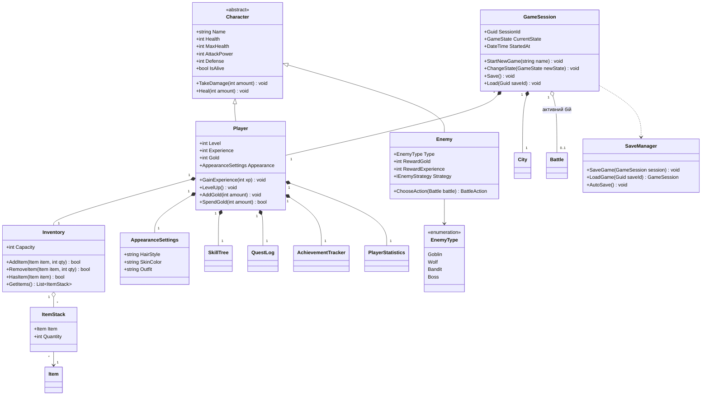
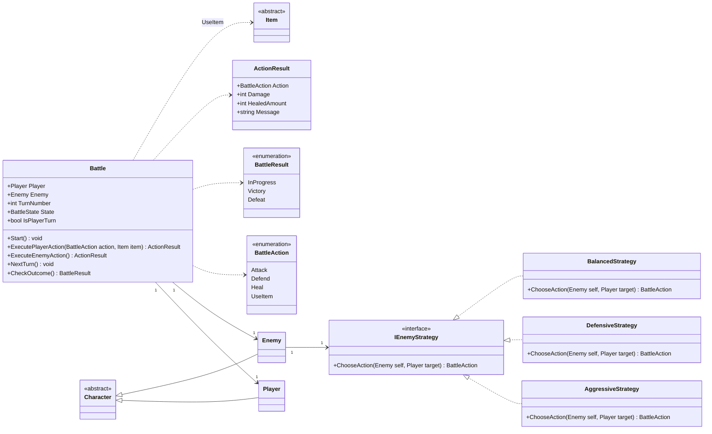
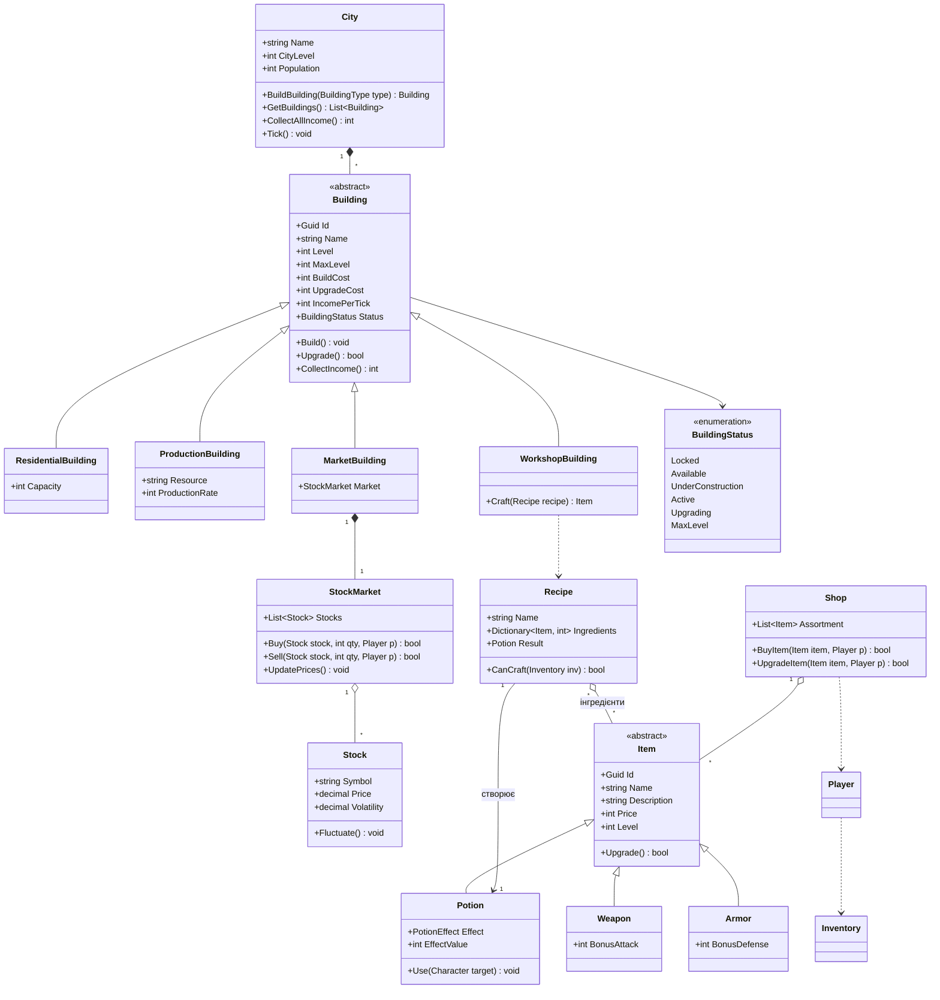
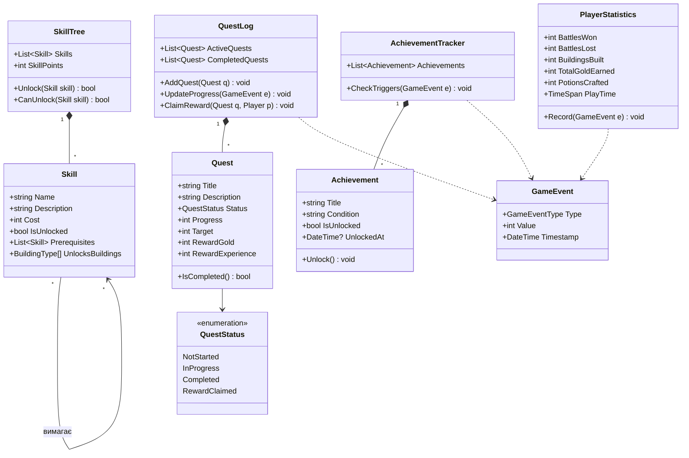
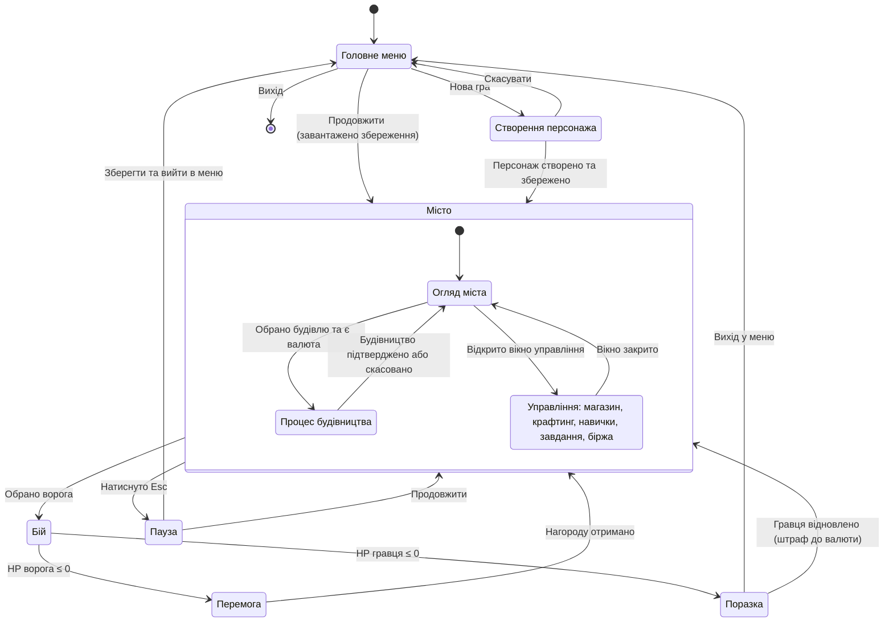
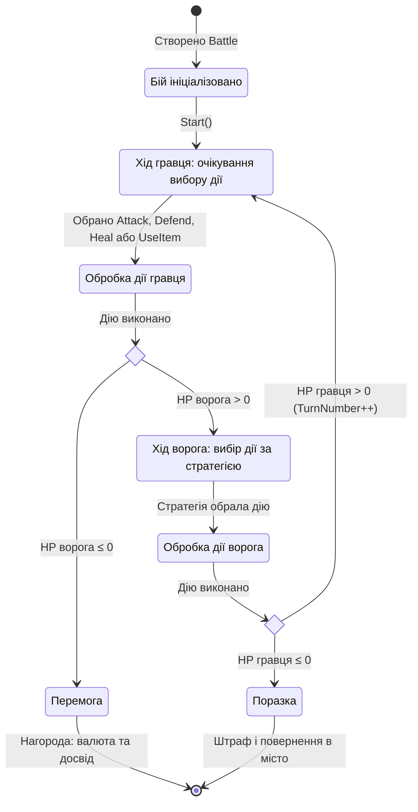
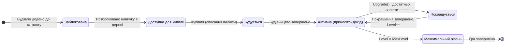
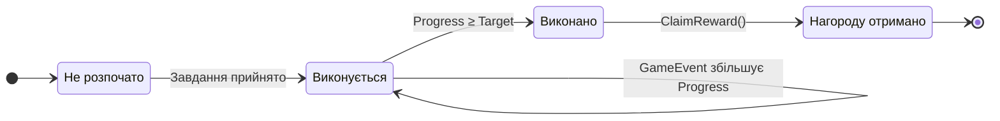

# UML-діаграми проєкту AcutStudio

Діаграми написані в **Mermaid** і автоматично відображаються на GitHub. Імена класів і методів відповідають C#/.NET (PascalCase).

Зміст:

1. [Діаграма класів](#1-діаграма-класів)
   - 1.1 Ядро гри та персонажі
   - 1.2 Бойова система
   - 1.3 Місто, економіка та предмети
   - 1.4 Прогрес: навички, завдання, досягнення, статистика
2. [Діаграми станів](#2-діаграми-станів)
   - 2.1 Стани гри
   - 2.2 Життєвий цикл бою
   - 2.3 Життєвий цикл будівлі
   - 2.4 Життєвий цикл завдання

---

## 1. Діаграма класів

Позначення зв'язків:

| Нотація | Зв'язок |
| :--- | :--- |
| `A <\|-- B` | Наслідування (B успадковує A) |
| `A *-- B` | Композиція (B не існує без A) |
| `A o-- B` | Агрегація (B може існувати окремо) |
| `A --> B` | Асоціація (A використовує / знає про B) |
| `A ..> B` | Залежність |
| `A ..\|> B` | Реалізація інтерфейсу |

### 1.1 Ядро гри та персонажі

### 1.2 Бойова система

### 1.3 Місто, економіка та предмети

### 1.4 Прогрес: навички, завдання, досягнення, статистика

### Коротко про ключові рішення

- **Наслідування**: `Character` → `Player`, `Enemy`; `Building` → 4 типи; `Item` → `Potion`, `Weapon`, `Armor`. Нові типи додаються без зміни наявного коду (вимога масштабованості).
- **Композиція**: `GameSession` володіє `Player` і `City`; `Player` володіє `Inventory`, `SkillTree`, `QuestLog` тощо; `City` володіє `Building`.
- **Агрегація**: `Inventory` → `ItemStack`, `Shop` → `Item`, `StockMarket` → `Stock` (об'єкти існують незалежно від контейнера).
- **Стратегія (Strategy)**: `IEnemyStrategy` задає унікальну поведінку ворогів у бою.
- **Події**: `GameEvent` розв'язує завдання, досягнення й статистику від решти логіки (єдине джерело тригерів).

---

## 2. Діаграми станів

### 2.1 Стани гри

**Таблиця переходів (стани гри)**

| Звідки | Куди | Тригер | Умова / дія |
| :--- | :--- | :--- | :--- |
| Початок | Головне меню | Запуск застосунку | Ініціалізація ресурсів |
| Головне меню | Створення персонажа | Кнопка «Нова гра» | Створюється нова `GameSession` |
| Головне меню | Місто | Кнопка «Продовжити» | `SaveManager.LoadGame()` успішний |
| Створення персонажа | Місто | Підтвердження | Ім'я та параметри валідні, збереження |
| Місто (огляд) | Місто (будівництво) | Вибір будівлі | `Player.Gold ≥ BuildCost`, будівля `Available` |
| Місто | Бій | Вибір ворога | Створюється `Battle` |
| Бій | Перемога | `Enemy.Health ≤ 0` | Нарахування нагород, оновлення статистики |
| Бій | Поразка | `Player.Health ≤ 0` | Фіксація поразки |
| Перемога / Поразка | Місто | Кнопка «Продовжити» | Автозбереження |
| Місто | Пауза | Клавіша Esc | Зупинка тіків симуляції |

### 2.2 Життєвий цикл бою

### 2.3 Життєвий цикл будівлі

### 2.4 Життєвий цикл завдання

---