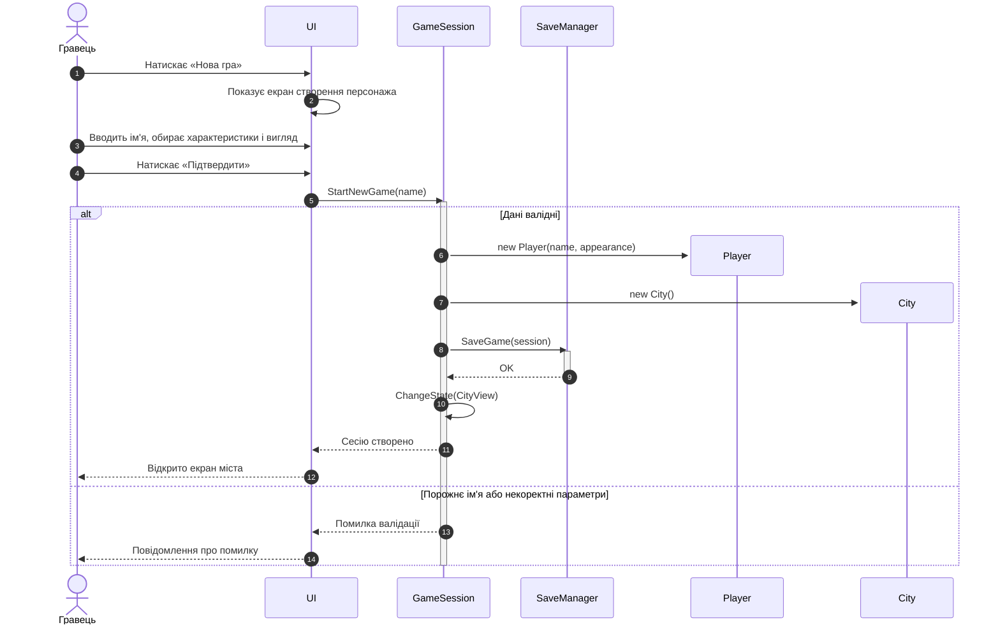
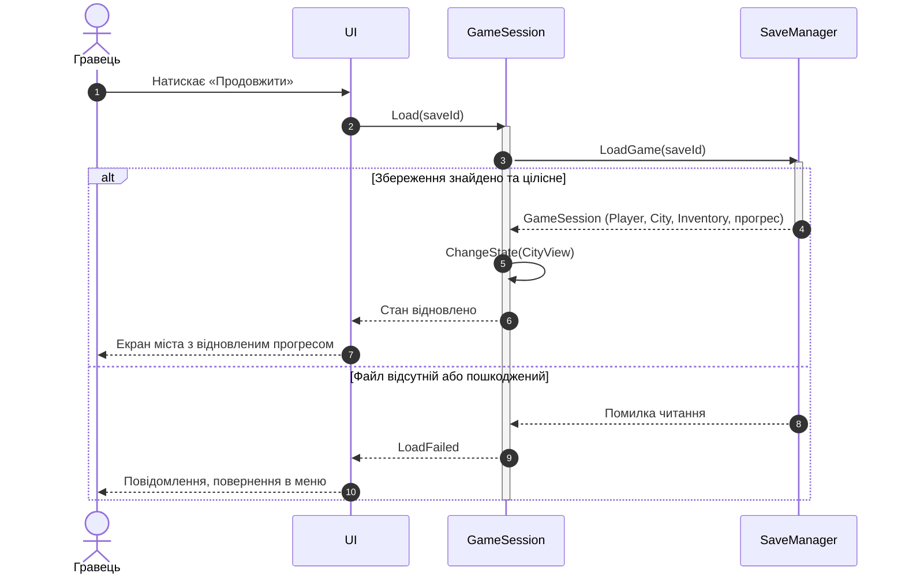
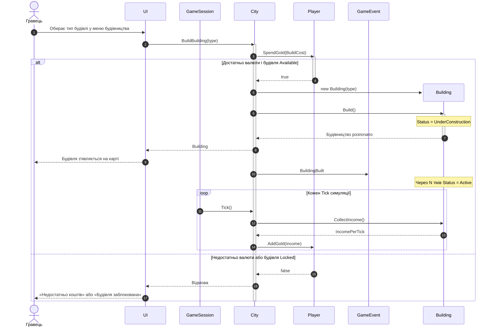
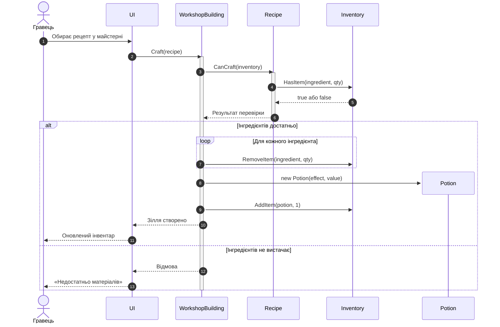
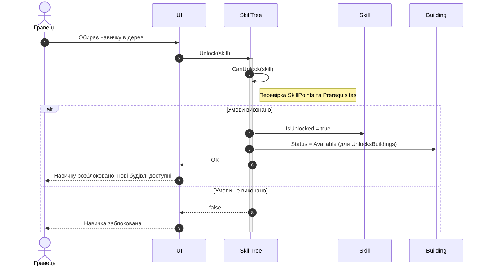
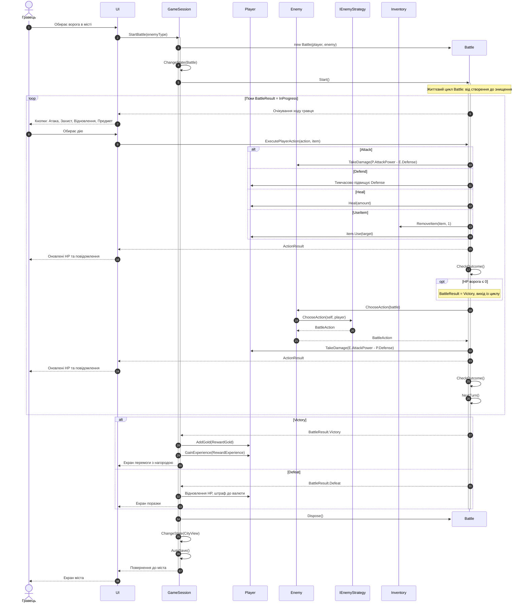
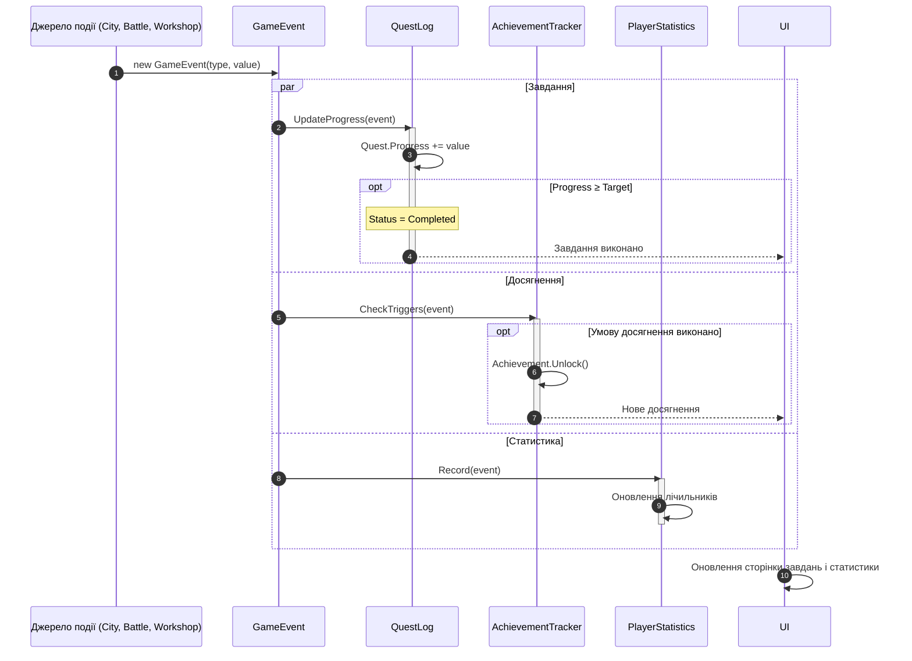

## Учасники

| Учасник | Тип | Роль |
| :--- | :--- | :--- |
| Гравець | Актор | Взаємодіє з інтерфейсом мишею та клавіатурою |
| UI | Boundary | Форми WinForms/WPF: меню, місто, бій |
| GameSession | Control | Керує станом гри та поточною сесією |
| SaveManager | Сервіс | Збереження й завантаження (БД / файл) |
| City, Building, Shop | Entity | Місто, будівлі, магазин |
| Player, Inventory | Entity | Гравець та його інвентар |
| Battle, Enemy, IEnemyStrategy | Entity | Бій, ворог і його стратегія |
| SkillTree, QuestLog, AchievementTracker, PlayerStatistics | Entity | Прогрес гравця |

## Покриття прецедентів

| № | Сценарій | Прецедент | Розділ |
| :--- | :--- | :--- | :--- |
| 1 | Нова гра та створення персонажа | Меню | 1.1 |
| 2 | Продовження гри (завантаження) | Меню | 1.2 |
| 3 | Будівництво будівлі | Місто | 2.1 |
| 4 | Крафтинг зілля | Місто | 2.2 |
| 5 | Розблокування навички | Місто | 2.3 |
| 6 | Бій: повний цикл | Бій | 3.1 |
| 7 | Обробка ігрових подій (завдання, досягнення, статистика) | Наскрізний | 4 |

Умовні позначення: суцільна стрілка `->>` — виклик, пунктирна `-->>` — повернення результату, прямокутник на лінії життя — час виконання операції (activation), хрестик — знищення об'єкта.

---

## 1. Головне меню

### 1.1 Нова гра та створення персонажа

### 1.2 Продовження гри (завантаження)

---

## 2. Місто

### 2.1 Будівництво будівлі

### 2.2 Крафтинг зілля

### 2.3 Розблокування навички

---

## 3. Бій

### 3.1 Повний цикл бою

---

## 4. Наскрізний процес: обробка ігрових подій

Після кожної значущої дії (побудовано будівлю, виграно бій, створено зілля) генерується `GameEvent`. Три підсистеми обробляють його незалежно одна від одної.

