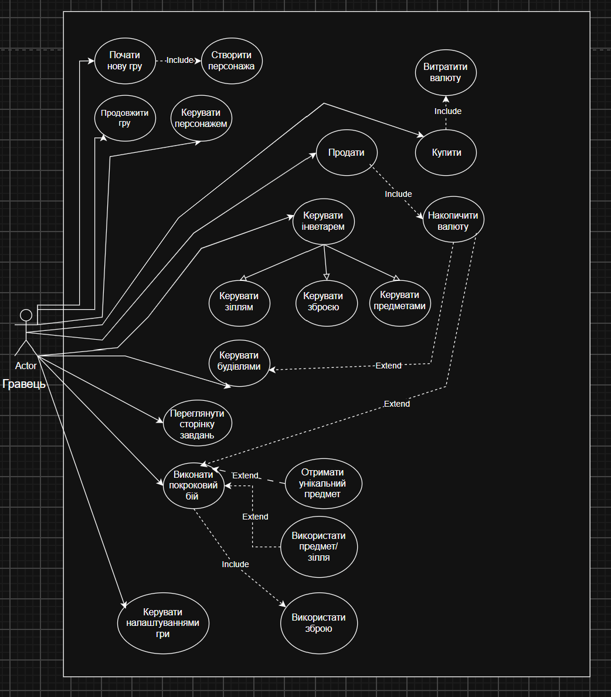

# Use Case Diagram

# Опис основних сценаріїв

## 1. Специфікація прецеденту: «Почати нову гру»

* **Назва:** Почати нову гру (з включенням «Створити персонажа»)
* **Актор:** Гравець 
* **Короткий опис:** Дозволяє гравцю ініціювати новий ігровий процес та налаштувати базові параметри свого героя.
* **Передумови (Pre-conditions):**
  1. Гравець запустив застосунок і перебуває в головному меню.
* **Основний сценарій (Happy Path):**
  1. Гравець обирає опцію «Почати нову гру» в головному меню.
  2. Система активує підпроцес створення персонажа (`Include` ➔ «Створити персонажа»).
  3. Система відкриває інтерфейс налаштування персонажа (вибір імені, класу, зовнішності або стартових характеристик).
  4. Гравець вводить/обирає параметри героя та натискає кнопку підтвердження.
  5. Система перевіряє коректність даних, зберігає створеного персонажа та завантажує стартову ігрову локацію.
* **Постумови (Post-conditions):**
  1. Створено нового персонажа, ігрову сесію ініційовано, гравець переведений на ігровий екран(екран симулятора міста).

---
## 2. Специфікація прецеденту: «Продовжити гру»

* **Назва:** Продовжити гру
* **Актор:** Гравець 
* **Короткий опис:** Дозволяє гравцю завантажити попередньо збережений ігровий процес та продовжити його з місця останнього збереження.
* **Передумови (Pre-conditions):**
  1. Гравець перебуває в головному меню програми.
  2. У системі наявний принаймні один файл збереження (збережена гра).
* **Основний сценарій (Happy Path):**
  1. Гравець обирає опцію «Продовжити гру» в головному меню.
  2. Система зчитує файл останнього збереження з пам'яті пристрою.
  3. Система завантажує ігрові дані (стан персонажа, інвентар, позицію на карті, стан будівель).
  4. Система переводить гравця з головного меню на основний ігровий екран.
* **Альтернативні сценарії (Extensions):**
  * *2а. (Файл збереження відсутній):* Якщо збережень немає, кнопка «Продовжити гру» заблокована (неактивна), або система виводить сповіщення про відсутність збережень.
* **Постумови (Post-conditions):**
  1. Ігрову сесію відновлено, гравець продовжує гру з точки збереження.

---

## 3. Специфікація прецеденту: «Керувати персонажем»

* **Назва:** Керувати персонажем
* **Актор:** Гравець 
* **Короткий опис:** Надає базовий контроль над пересуванням, діями та станом головного героя на ігровій локації чи карті.
* **Передумови (Pre-conditions):**
  1. Гравець перебуває в активному ігровому процесі (після старту чи завантаження гри).
* **Основний сценарій (Happy Path):**
  1. Гравець за допомогою клавіатури, миші чи інтерфейсу задає напрямок руху або взаємодії персонажа.
  2. Система обробляє введення та змінює координати / стан персонажа на ігровому полі.
  3. Система оновлює графічне відображення персонажа та оточення в режимі реального часу.
* **Постумови (Post-conditions):**
  1. Позиція та статус персонажа на ігровій карті оновлено.

  ---

## 4. Специфікація прецеденту: «Керувати інвентарем»

* **Назва:** Керувати інвентарем
* **Актор:** Гравець 
* **Короткий опис:** Надає гравцю доступ до перегляду та організації своїх внутрішньоігрових ресурсів (зіллям, зброєю, предметами).
* **Передумови (Pre-conditions):**
  1. Гравець перебуває безпосередньо в ігровому процесі.
* **Основний сценарій (Happy Path):**
  1. Гравець натискає гарячу клавішу або кнопку інтерфейсу для відкриття інвентарю.
  2. Система відображає сітку інвентарю з категоріями («Зілля», «Зброя», «Предмети»).
  3. Гравець обирає потрібну категорію чи конкретний предмет.
  4. Гравець виконує бажану дію (перемістити, переглянути характеристики).
  5. Система оновлює графічний інтерфейс інвентарю.
  6. Надана можливість крайтингу зброї, зілля, предметів за накопичену валюту(ресурс).
* **Постумови (Post-conditions):**
  1. Актуальний стан інвентарю збережено.

---

## 5. Специфікація прецеденту: «Керувати будівлями»

* **Назва:** Керувати будівлями
* **Актор:** Гравець 
* **Короткий опис:** Дозволяє гравцю купувати нові споруди, покращувати їх або керувати їх функціоналом на ігровій карті.
* **Передумови (Pre-conditions):**
  1. Гравець перебуває на екрані стратегічної карти або бази.
* **Основний сценарій (Happy Path):**
  1. Гравець обирає меню будівництва, магазин будівель чи конкретну ігрову будівлю.
  2. Система показує доступні опції (купити,побудувати, покращити, зібрати ресурси).
  3. Гравець підтверджує вибір дії для конкретної споруди.
  4. Система перевіряє наявність необхідних ресурсів/валюти, списує їх та оновлює стан будівлі на екрані.
* **Альтернативні сценарії (Extensions):**
  * *4а. (Недостатньо ресурсів):* Якщо для будівництва чи покращення бракує валюти, система виводить сповіщення про брак коштів і скасовує дію.
* **Постумови (Post-conditions):**
  1. Зміни у стані будівель та балансі ресурсів застосовано.

---

## 6. Специфікація прецеденту: «Купити»

* **Назва:** Купити
* **Актор:** Гравець
* **Короткий опис:** Дозволяє гравцю придбати нові будівлі, предмети, зброю чи зілля за ігрову валюту(гроші або ресурси).
* **Передумови (Pre-conditions):**
  1. Гравець відкрив інтерфейс магазину.
* **Основний сценарій (Happy Path):**
  1. Гравець обирає товар із асортименту магазину та натискає «Купити».
  2. Система ініціює процес витрати валюти (`Include` ➔ «Витратити валюту»).
  3. Система перевіряє, чи достатньо у гравця коштів.
  4. Система списує відповідну кількість валюти у гравця та додає придбаний товар до його інвентарю.
  5. Система оновлює баланс коштів на екрані та виводить повідомлення про успішну покупку.
* **Альтернативні сценарії (Extensions):**
  * *3а. (Брак коштів):* Якщо баланс менший за вартість товару, транзакція відхиляється, система показує сповіщення про нестачу валюти.
* **Постумови (Post-conditions):**
  1. Баланс валюти зменшено, предмет перенесено до інвентарю гравця.

---

## 7. Специфікація прецеденту: «Продати»

* **Назва:** Продати
* **Актор:** Гравець 
* **Короткий опис:** Надає можливість гравцю позбутися непотрібних предметів зі свого інвентарю в обмін на ігрову валюту(гроші).
* **Передумови (Pre-conditions):**
  1. Відкрито інтерфейс магазину.
* **Основний сценарій (Happy Path):**
  1. Гравець обирає предмет зі свого інвентарю для продажу.
  2. Система розраховує вартість продажу та запитує підтвердження.
  3. Гравець підтверджує продаж.
  4. Система ініціює процес накопичення валюти (`Include` ➔ «Накопичити валюту»).
  5. Система видаляє предмет з інвентарю та зараховує відповідну суму ігрової валюти гравцю.
  6. Система оновлює відображення інвентарю та гаманця.
* **Постумови (Post-conditions):**
  1. Предмет вилучено з інвентарю, баланс валюти гравця збільшено.

  ---

  ## 8. Специфікація прецеденту: «Виконати покроковий бій» 
* **Назва:** Виконати покроковий бій(з включенням використання зброї та предметів/зілля, отримання унікальних предметів)
* **Актор:** Гравець 
* **Короткий опис:** Описує процес тактичного бою між персонажем гравця та супротивниками у покроковому режимі.
* **Передумови (Pre-conditions):**
  1. Персонаж гравця вступив у зіткнення з противником на ігровій карті.
* **Основний сценарій (Happy Path):**
  1. Система ініціює бойовий режим і формує черговість ходів.
  2. У хід гравця система виводить інтерфейс бойових дій.
  3. Гравець обирає дію (атакувати, захиститися, застосувати спорядження).
  4. За необхідності гравець активує підпроцеси через розширення чи включення (`Include` ➔ «Використати зброю», `Extend` ➔ «Використати предмет/зілля»).
  5. Система розраховує результати ходу (нанесення шкоди, витрата ресурсів).
  6. Здійснюється хід супротивника.
  7. Цикл повторюється до досягнення умов перемоги або поразки (знищення ворога або героя).
* **Альтернативні сценарії (Extensions):**
  * *5а. (Перемога та нагорода):* Якщо ворога переможено, спрацьовує розширення (`Extend` ➔ «Отримати унікальний предмет»), і гравець отримує нагороду до інвентарю.
* **Постумови (Post-conditions):**
  1. Бій завершено, стан здоров'я та інвентар персонажа оновлено, гра повертається до звичайного режиму дослідження.

---

## 9. Специфікація прецеденту: «Керувати налаштуваннями гри»

* **Назва:** Керувати налаштуваннями гри
* **Актор:** Гравець 
* **Короткий опис:** Дозволяє гравцю змінювати системні параметри гри (гучність звуку, керування, графіку).
* **Передумови (Pre-conditions):**
  1. Гравець відкрив меню налаштувань з головного меню.
* **Основний сценарій (Happy Path):**
  1. Система відображає панель параметрів (повзунки гучності, перемикачі графіки).
  2. Гравець змінює бажаний параметр.
  3. Гравець натискає кнопку «Зберегти» або «Застосувати».
  4. Система застосовує нові конфігурації та зберігає їх у файлі налаштувань.
* **Постумови (Post-conditions):**
  1. Змінені параметри гри збережено та активовано системою.